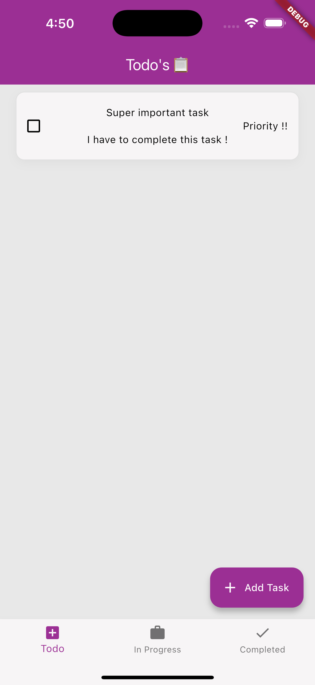
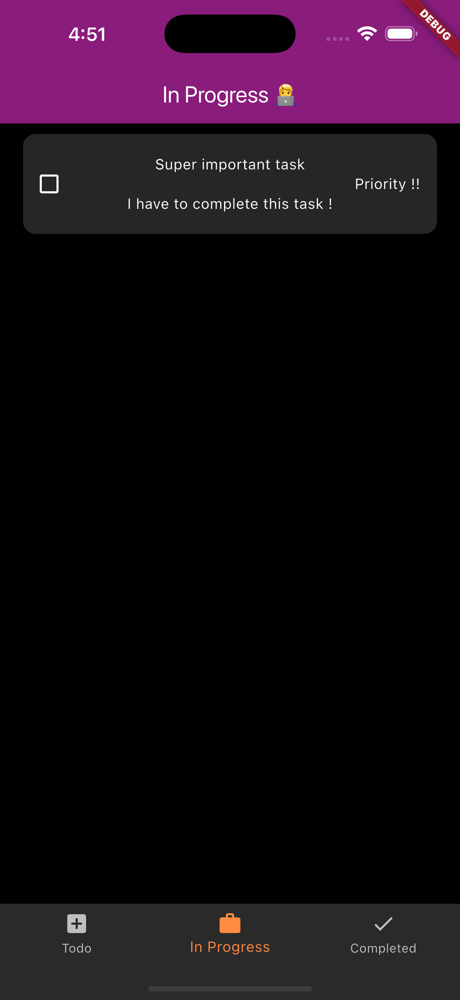
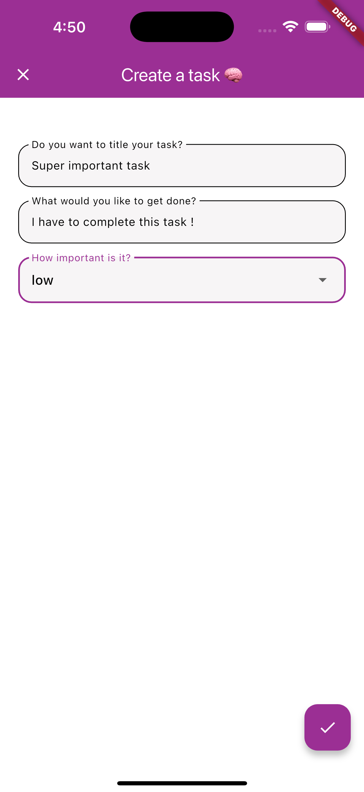
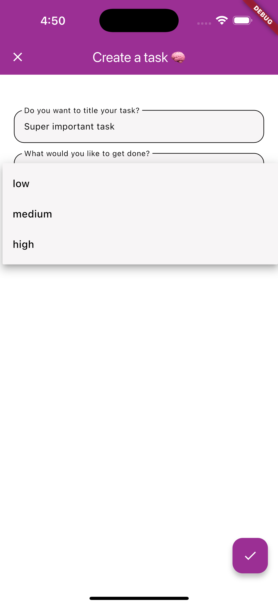
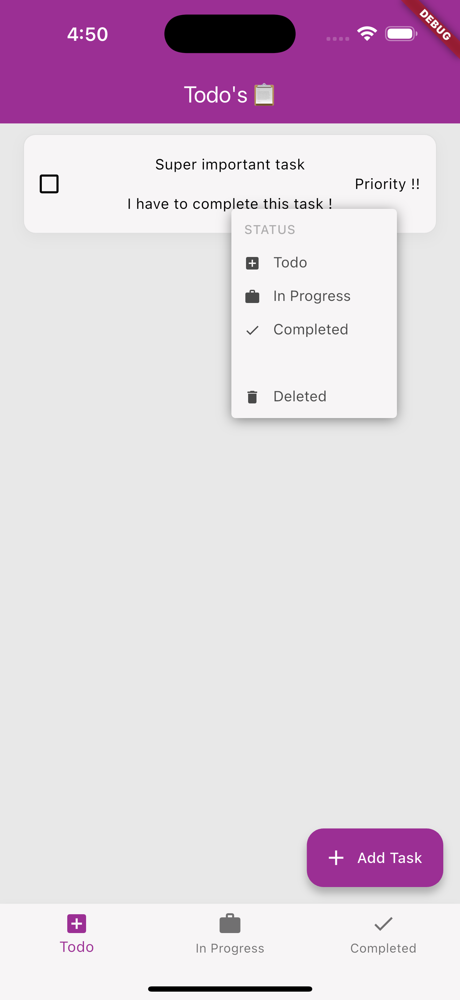
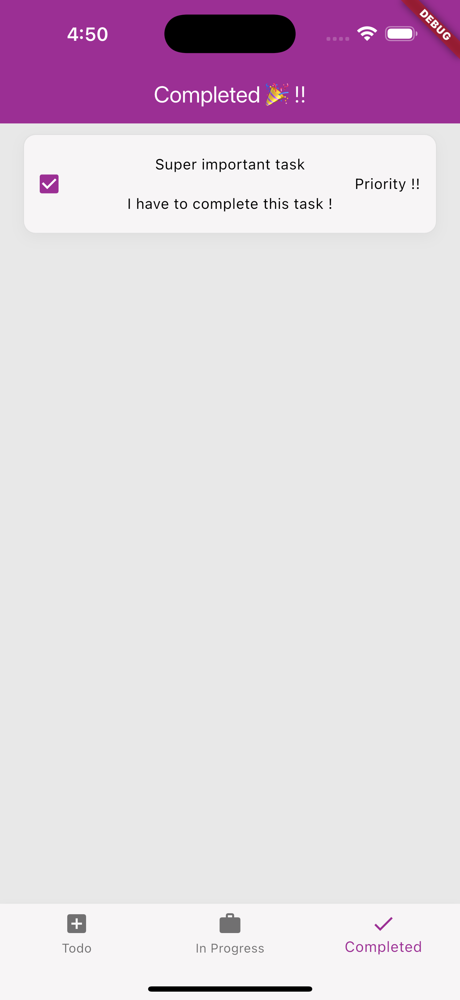

# simple_kanban

This is a simple kanban app. It is build using Flutter and Bloc for state management.
The List automatically sorts itself base on priority. The application currently works
on android and iOS with a web version and table version coming soon.

## Getting Started

to run the project

```
flutter run

or

flutter build apk --release (for android)
```

## Project Structure

.
└── lib/
├── screens
├── services
├── state
├── utilities
└── main.dart

## Screenshots

<table>
  <tr>
    <td></td>
    <td></td>
    <td></td>
    <td></td>
    <td></td>
    <td></td>
  </tr>
</table>

<table>
  <tr>
    <td></td>
    <td></td>
    <td></td>
  </tr>
</table>

## Important

1. The project needs to be signed by you before you install
2. PR's are welcome be should never be to the main branch
3. Use the templates to create PR's.
4. Don't break the project structure. (Not a hard rule)
5. If you face any issues feel free to open an issue
